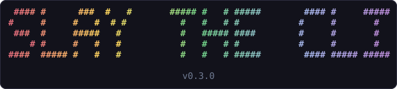
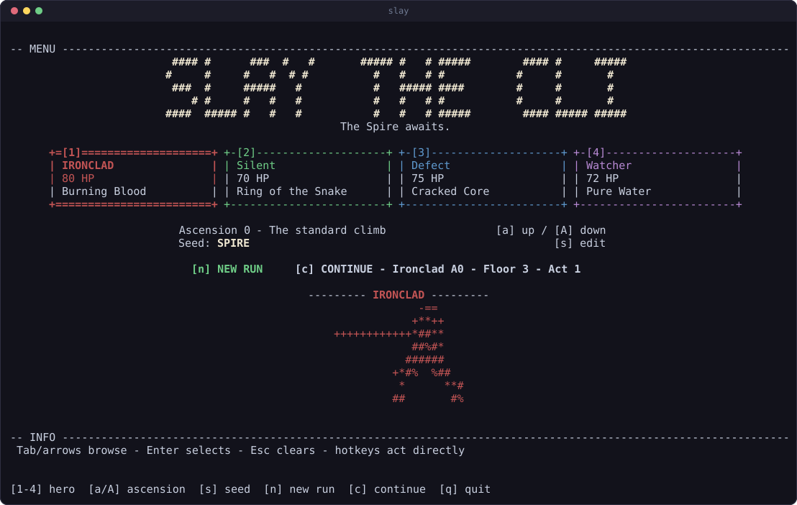
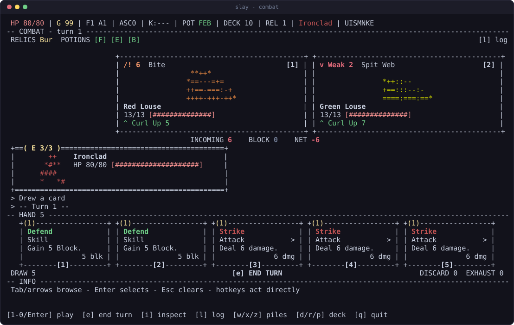
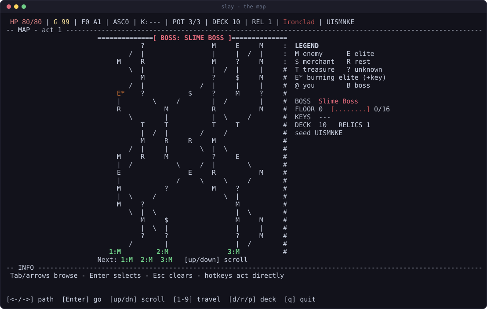

<p align="center">
  
</p>

<p align="center">
  
  
  
  
  
</p>

<p align="center">
  
  
  
  
  
  
</p>

Slay the Spire (V2.3.4), adapted faithfully to the command line. The whole climb
is here: 370 cards, 181 relics, 42 potions, 65 monsters, 51 events, all four
characters, Ascension 0 to 20, Acts 1 through 4 and the Corrupt Heart. Every
number and behavior comes from audited data rather than memory. Pure TypeScript,
deterministic, no runtime dependencies, drawn in plain ASCII with ANSI color.

## Play

```sh
git clone https://github.com/anthonykrivonos/slay-the-cli.git ~/.slay-the-cli/app
cd ~/.slay-the-cli/app
bun install          # or npm / pnpm / yarn install
bun src/cli/main.ts  # or npm start
```

Needs `git`, a terminal at least 80x24, and either [Bun](https://bun.sh) or
Node 18+. Every launch checks for a newer version in the background and says so
on the menu; `slay --update` applies one.

**[Full installation guide](docs/INSTALL.md)** for putting `slay` on your `PATH`
on Linux, macOS and Windows, choosing a package manager, how updating works, and
troubleshooting.

## Screenshots

Not mockups. Every picture is the renderer's own output for a snapshot fixture,
painted to SVG by `tools/gen-readme-shots.ts`, so it cannot drift from the game.

**Pick your survivor.** Four characters, Ascension 0 to 20, one seed box.



**Fight.** Intents up top, your hand as card-shaped boxes, the combat log
between them. Every creature is drawn in the average color of its own sprite.



**Climb.** The act map scrolls, remembers where you have been, and tells you
what each glyph means.



More frames, including the same fight at 80x24 and at 132x45, are in
[the playing guide](docs/CONTROLS.md#the-layout-is-fluid).

## Docs

| | |
| --- | --- |
| **[Installing](docs/INSTALL.md)** | package managers, per-platform `PATH` setup, updating, flags, troubleshooting |
| **[Playing](docs/CONTROLS.md)** | keys, the fluid layout, saves, color |
| **[Contributing](docs/CONTRIBUTING.md)** | setup, scripts, project layout, and the rules that get a PR sent back |
| **[Legal](docs/LEGAL.md)** | the full notice: unaffiliated fan work, no game code or assets |

## About the AI in this repository

Most of the code here was written by a large language model (Claude), directed
and reviewed by a human. That is not an apology appended after the fact, it is
how the thing got built, and the design shows it: the snapshot fixtures, the
corpus audit and the enforced purity boundaries exist because generated code
needs mechanical proof that it is right, not because anyone enjoys writing
assertions.

- **Read it before you trust it.** The tests are the argument for correctness,
  not the byline. Where the code and the corpus disagree, the corpus wins.
- **If you object to AI-generated code on principle, do not contribute, and
  consider not using this.** That is a coherent position and no one here will
  try to talk you out of it. Fork it, rewrite it, or walk away, all fine.
- **Contributions are judged the same regardless of what typed them.** See
  [CONTRIBUTING.md](docs/CONTRIBUTING.md), and disclose AI assistance in the PR.
- Pull requests that only remove this section will be closed.

## Legal

Slay the CLI is an unofficial, non-commercial fan reimplementation, not
affiliated with or endorsed by Mega Crit Games LLC. It contains no game code, no
game assets, and no copied prose. Nothing here is a substitute for owning the
game: **buy Slay the Spire.** Full notice in **[docs/LEGAL.md](docs/LEGAL.md)**.
