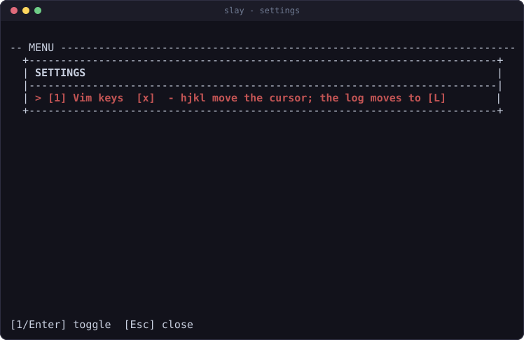
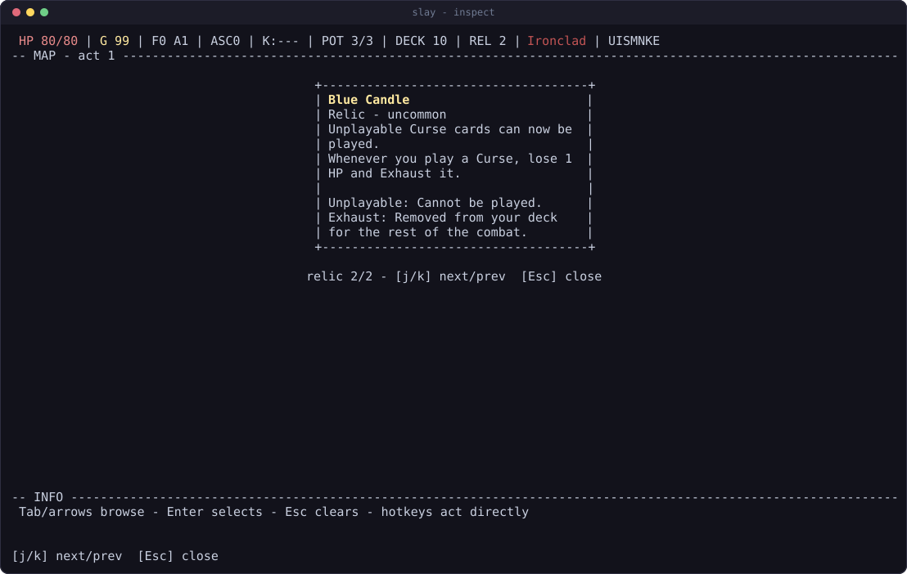
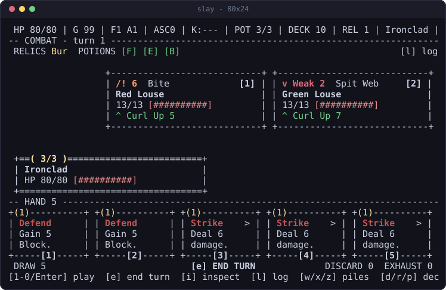
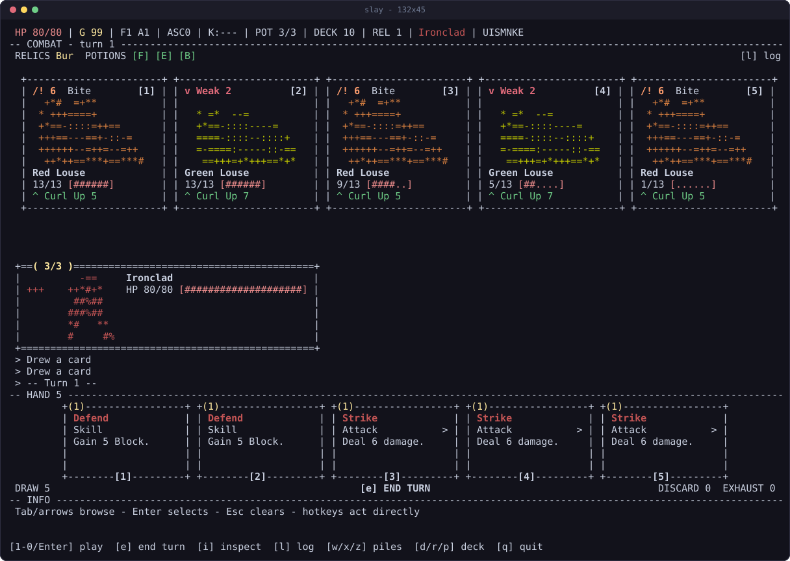
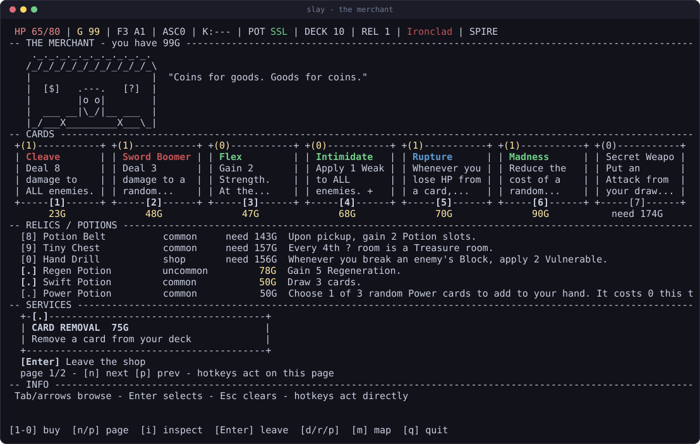

# Playing

Keys, the fluid layout, and where your run is kept.

## Keys

Number keys select, letters act.

| key | does |
| --- | --- |
| `1`-`0` | pick the numbered thing: a card, a reward, a shop item, a path |
| `Enter` | activate whatever the cursor is on |
| `Esc` | clear the cursor, or close the top overlay |
| `Tab` / `Shift-Tab` | move the hover cursor forward and back |
| arrows | move the hover cursor; on the map, scroll and change path |
| `e` | end turn |
| `i` | inspect what the cursor is on, in full |
| `j` / `k` | while inspecting, step to the next and previous thing; arrows work too |
| `l` | combat log |
| `m` | the act map, read-only, from anywhere in a run |
| `d` / `r` / `p` | deck, relics, potions |
| `w` / `x` / `z` | draw, discard and exhaust piles |
| `n` / `p` | next and previous page, on any list that has more than one |
| `n` / `c` | new run, continue (on the menu) |
| `a` / `A` | ascension up and down (on the menu); `+` and `-` also work |
| `s` | edit the seed (on the menu) |
| `S` | settings, from the menu or from anywhere in a run |
| `q` | quit: instant on the menu, `[y]`/`[n]` confirmation mid-run |
| `Ctrl+C` | quit immediately from anywhere, still safely |

Every screen prints its own key hints along the bottom row, so this table is a
reference rather than something to memorize.

The hover cursor is read-only: moving it never commits anything. Whatever it
points at is explained in the INFO panel at the bottom. On menus and lists the
cursor doubles as the selection, so `Enter` activates it and `Esc` clears it.

## Vim keys

Off by default. `S` opens settings from the menu or from anywhere in a run, and
`Enter` or `[1]` flips them. The answer is kept in `prefs.json`, so it survives
quitting.

With them on, `h` `j` `k` `l` are the arrow keys on every screen: they move the
hover cursor, choose between paths on the map, and step through an inspected
collection. Exactly one thing has to move out of the way, the combat log, which
answers to `L` instead. Every other letter keeps its job: `e` end turn, `i`
inspect, `d` `r` `p` deck, relics and potions, `w` `x` `z` piles.

Two things deliberately do not change. `j` and `k` already stepped through
inspected cards and scrolled the map, so they mean the same thing either way.
And typing a seed is still typing, so `s` then `hjkl` spells HJKL.

Whichever way the setting sits, the hint line along the bottom prints the keys
that are actually live, so a fight reads `[L] log` under vim bindings and
`[l] log` without them.



`m` opens the act map over whatever room you are standing in: a shop, a
campfire, a fight. It is read-only, so it answers "what is coming" without
letting you leave the room you are in. `up`/`down` scroll it, `Esc` or `m`
again puts it away.

## Nothing is hidden from you

`i` opens whatever the cursor is on at full size: any card, any relic, any
potion, from any screen. The merchant's stock, a card in your draw pile, a
reward you have not taken, a card the smith is about to upgrade, the relics you
are already carrying. Card boxes are narrow and the INFO panel is short, so both
cut long text; `i` is the copy that never does.



A card shows both of its states side by side, captioned: unupgraded on the left,
upgraded on the right, the one you are actually holding in full color and the
other dim. So the smith, the merchant and every card reward answer "what does
the `+` buy me" before you spend anything.

It also explains itself. Under the rules text, every keyword the item names gets
a one-line definition, so you do not have to already know what Vulnerable,
Plated Armor or Evoke do. `j` and `k` walk the rest of the collection without
closing the box, and `Enter` still does the obvious thing: play the card, take
the reward, buy the item, drink the potion. `Esc` puts you back exactly where
you were, list and page intact.

## The layout is fluid

The game uses every column and row you give it, and degrades in steps rather
than clipping.

**At 80x24**, the minimum, every screen compacts to dense one-liners. Nothing
important is dropped, it just gets terser.



**At 120x36 and up**, enemy panels, card-shaped boxes, scene art and the bottom
INFO panel appear, and every monster and your hero are drawn as ASCII portraits
inside their panels, each creature tinted with the average color of its own
sprite.


**At 132x45**, a crowded room still gives all five monsters a full portrait, and
the cards in hand grow taller.



Resizing mid-run is fine. The frame is recomputed from the terminal's current
size on every repaint, and the layout math is clamped at every size, so there is
no size that breaks it.

## Reading a fight

Cards print what they will really do, not what they were printed with. The last
row of every card box carries the live number: `9 dmg` on a Strike under
Strength 3, `3 blk` on a Defend under Frail, `5 dmg x2` on Twin Strike. It goes
green when a power raised it and red when Weak or Frail cut it, so a bad turn is
visible before you commit to it. Aiming a card prices every enemy in the
targeting strip (`[1] Cultist (9)`), which is where Vulnerable shows up.

Between the enemies and your panel, one line says how the turn ends:

```
INCOMING 16    BLOCK 5    NET -11
```

That is every living attacker's damage added up against the block you are
holding, in one place, because they used to sit at opposite ends of the screen.

The header carries a potion slot per character, always: `POT F-B` is a Fire
Potion, an empty slot and a Block Potion. The log names the card that was
played, including the ones you did not choose: `Havoc plays Immolate`.

## Screens

**The map** scrolls, remembers where you have been, and carries a legend for
every glyph.


**The merchant** pages through cards, relics, potions and card removal, with
prices and what you cannot yet afford.



## Saves

The run is written to `~/.slay-the-cli/save.json` after **every action**, so
quitting is always safe: `q` and Ctrl+C both exit cleanly, and `c` on the menu
resumes exactly where you left off. There is no save slot to manage and no
confirmation to sit through.

`prefs.json` beside it remembers your last character, seed, ascension, color
setting and whether vim keys are on, so the menu comes back the way you left it.

`SLAY_DIR` moves both files elsewhere. See
[INSTALL.md](INSTALL.md#where-things-live) for the full layout, and its
[troubleshooting section](INSTALL.md#troubleshooting) if a run seems to have
gone missing.

## Color

Color is on by default and uses xterm-256. `--no-color` or `NO_COLOR=1` gives
plain output, which is also what you get when the output is not a terminal.
Every frame is pure ASCII underneath, so the game is readable either way.

Color carries meaning rather than decoration. Map nodes wear their room: green
rest, blue merchant, gold treasure, red elite, purple unknown, and bold for the
rooms you can actually walk to. Cards wear their type: red attacks, green
skills, blue powers. Nothing depends on it, and the legend spells out every
glyph anyway.
