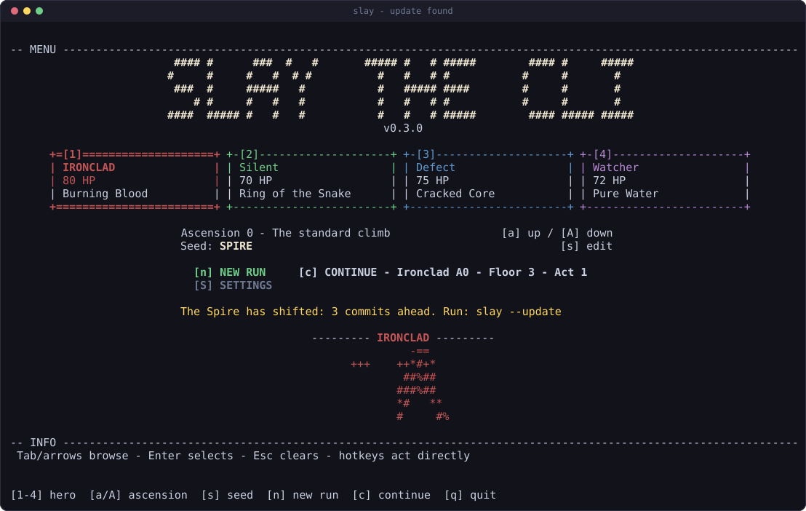

# Installing Slay the CLI

Everything about getting it running, keeping it updated, and taking it off
again. If you just want to play once, the [quick start](#quick-start) is four
lines and you can stop there.

- [Requirements](#requirements)
- [Quick start](#quick-start)
- [Choosing a package manager](#choosing-a-package-manager)
- [Installing it for good](#installing-it-for-good)
  - [Linux and macOS](#linux-and-macos)
  - [Windows](#windows)
  - [Without Bun](#without-bun)
- [Where things live](#where-things-live)
- [Updating](#updating)
- [Command-line flags and environment](#command-line-flags-and-environment)
- [Troubleshooting](#troubleshooting)
- [Uninstalling](#uninstalling)

## Requirements

- `git`
- Either [Bun](https://bun.sh) or Node 18 or newer. Bun runs the TypeScript
  directly; Node runs it through [tsx](https://tsx.is).
- A terminal at least 80x24 that understands ANSI. Bigger is better: at 120x36
  and up, every creature gets an ASCII portrait.

Bun is optional for playing. Two things do want it, and neither is playing: the
test suite (every test file imports `bun:test`) and `bun run build`, which
compiles the standalone binary.

## Quick start

```sh
git clone https://github.com/anthonykrivonos/slay-the-cli.git ~/.slay-the-cli/app
cd ~/.slay-the-cli/app
bun install          # or npm / pnpm / yarn install
bun src/cli/main.ts  # or npm start
```

That is enough to play forever. Everything below is convenience.

## Choosing a package manager

Use whichever you already have. All four are tested.

| | install | play |
| --- | --- | --- |
| **Bun** | `bun install` | `bun src/cli/main.ts` |
| **npm** | `npm install` | `npm start` |
| **pnpm** | `pnpm install` | `pnpm start` |
| **Yarn** | `yarn install` | `yarn start` |

Bun needs nothing installed at all, since it runs TypeScript natively and the
project has no runtime dependencies. The other three go through `tsx`, the only
devDependency, which is what `npm start` invokes.

Flags reach the game the same way in every case, except that npm needs `--`
first so it does not eat them itself:

```sh
bun src/cli/main.ts --seed SPIRE --character WATCHER --ascension 20
npm start -- --seed SPIRE --character WATCHER --ascension 20
```

Plain `node src/cli/main.ts` does **not** work, and the error is a confusing
`ERR_MODULE_NOT_FOUND`. Node's ESM resolver will not resolve this tree's
extensionless imports, and its type stripping rejects a TypeScript parameter
property in the engine. Use `npm start` (that is, `tsx`) on Node.

## Installing it for good

`bun run build` compiles a standalone binary to `dist/slay`. It is about 60 MB,
because the Bun runtime is baked in, and it needs nothing installed to run. Put
its directory on your `PATH` and `slay` works from anywhere.

### Linux and macOS

```sh
git clone https://github.com/anthonykrivonos/slay-the-cli.git ~/.slay-the-cli/app
cd ~/.slay-the-cli/app && bun install && bun run build
```

Then append this to `~/.bashrc` (bash) or `~/.zshrc` (zsh):

```bash
# ---- Slay the CLI --------------------------------------------------------
export SLAY_HOME="$HOME/.slay-the-cli"
export PATH="$SLAY_HOME/app/dist:$PATH"
# -------------------------------------------------------------------------
```

Open a new shell (or `source ~/.zshrc`) and run `slay`. That is the whole
install. [Updating](#updating) is built into the app, so there is no shell
function to paste and nothing to keep in sync.

Prefer a symlink to a `PATH` edit? This does the same job:

```sh
ln -sf "$HOME/.slay-the-cli/app/dist/slay" /usr/local/bin/slay
```

`SLAY_HOME` is not required for the game to run, but the update check uses it to
find the checkout, which matters if you move the binary somewhere else.

### Windows

Use Windows Terminal or PowerShell 7. The TUI needs ANSI and a real console, so
`cmd.exe` in legacy mode will not do. WSL works too, in which case follow the
Linux instructions inside it.

```powershell
git clone https://github.com/anthonykrivonos/slay-the-cli.git $HOME\.slay-the-cli\app
cd $HOME\.slay-the-cli\app; bun install; bun run build
```

Then append this to your profile (`notepad $PROFILE`, creating the file if it
does not exist):

```powershell
# ---- Slay the CLI --------------------------------------------------------
$env:SLAY_HOME = "$HOME\.slay-the-cli"
$env:Path = "$env:SLAY_HOME\app\dist;$env:Path"
# -------------------------------------------------------------------------
```

Restart the terminal and run `slay`. The binary lands at `app\dist\slay.exe`,
and `slay` finds it.

### Without Bun

Skip the binary and alias the Node path instead. It behaves identically, just
with a moment of startup while tsx compiles:

```bash
alias slay='npm --prefix "$HOME/.slay-the-cli/app" start --silent --'
```

`npm --prefix` runs the script with the project as its working directory, so
this works from anywhere.

## Where things live

Everything the game owns sits under one directory, `~/.slay-the-cli`: the
checkout in `app/`, and your saves at the root beside it.

```
~/.slay-the-cli/
  app/              the clone, with the compiled binary in app/dist/
  save.json         the run in progress, written after every action
  save.json.bak     the previous save, used if the main one is unreadable
  prefs.json        last character, seed, ascension, color
```

Saves sit outside the checkout on purpose. Updating, rebuilding, or even a
`git clean` inside `app/` cannot touch a run in progress.

`SLAY_DIR` overrides the save location if you want it elsewhere.

## Updating

Updating is part of the app, not something you wire up. Every launch checks
whether the checkout is behind `origin/main`, and when it is, the menu says so:



`slay --update` fast-forwards the clone, reinstalls dependencies, recompiles the
binary, and prints the commit you landed on. It touches only
`~/.slay-the-cli/app`, so a run in progress is never at risk. Running it when
you are already current skips the reinstall and the rebuild, so it costs a fetch
and nothing else.

### How the check stays free

Asking a remote at launch would mean waiting on the network before you can play,
and anything that prints while the game owns the screen scribbles over the
frame. So it does neither, and splits the work in two:

- **At startup**, it reads only the `origin/main` ref that git already has on
  disk. That is local, takes about 15 ms, and never touches the network.
- **The `git fetch`** that refreshes that ref is detached and unref'd, so it
  cannot delay startup, delay exit, or write to the terminal. Its result is
  simply there for the next launch to read.

So the notice is one launch stale by design. That is the whole trick: git's own
ref store is the cache between the two halves.

Checking is automatic but applying is not, deliberately. Recompiling a binary
out from under a running process is not something to do without being asked.

### Turning it off

- `--no-update-check` skips the check for one run.
- `SLAY_NO_UPDATE_CHECK=1` disables it permanently, network and all.

The check also does nothing, silently, when there is no git checkout (a copied
binary), no `git` on `PATH`, or no network. It never blocks and it never errors.

## Command-line flags and environment

```
slay [--seed FOO] [--character IRONCLAD] [--ascension 0] [--no-color]
slay --update
```

| flag | meaning |
| --- | --- |
| `--seed FOO` | starting seed |
| `--character ID` | `IRONCLAD`, `SILENT`, `DEFECT` or `WATCHER` |
| `--ascension N` | 0 to 20, clamped |
| `--no-color` | plain output, no ANSI color |
| `--update` | pull, reinstall, rebuild, then exit without starting the game |
| `--no-update-check` | skip the startup update check this run |
| `--help` | usage |

| variable | meaning |
| --- | --- |
| `SLAY_HOME` | install root, used to locate the checkout for updates |
| `SLAY_DIR` | where saves and prefs live (default `~/.slay-the-cli`) |
| `SLAY_NO_UPDATE_CHECK` | set to `1` to never check for updates |
| `NO_COLOR` | set to anything non-empty for plain output |

## Troubleshooting

**`slay: needs an interactive terminal (stdin and stdout must be TTYs).`**
The game is being piped or redirected. It needs a real terminal on both stdin
and stdout, so it cannot run under a pipe, a CI job, or a subprocess with
captured output.

**`Terminal too small`.** The minimum is 80x24. The message tells you the
current size. Every screen has a compact layout down to exactly that.

**`ERR_MODULE_NOT_FOUND` on `node src/cli/main.ts`.** Expected. Use `npm start`
(that is, `tsx`); see [choosing a package manager](#choosing-a-package-manager).

**The terminal is left in a strange state.** If the process was hard-killed, run
`reset`. Normal exits (`q`, Ctrl+C, even a crash) restore the terminal on the
way out.

**No color.** Check `NO_COLOR` is unset and `--no-color` is not being passed.

**`slay: no git checkout found to update`.** `--update` could not find the
clone. Set `SLAY_HOME` to the install root (the directory containing `app/`).

**A saved run vanished.** Saves live in `~/.slay-the-cli`, not in the checkout.
If you set `SLAY_DIR` for one launch and not the next, each looks in a different
place. An unreadable `save.json` falls back to `save.json.bak` automatically; a
save from an older engine build is discarded with a message on the menu rather
than crashing.

## Uninstalling

Remove the directory and the lines you added to your shell profile:

```sh
rm -rf ~/.slay-the-cli
```

That deletes the checkout, the compiled binary, and your saves together, since
they all live under that one root. If you symlinked into `/usr/local/bin`,
`rm /usr/local/bin/slay` as well.
